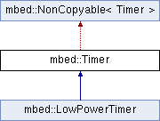

# Timer

Timer class hierarchy

Use the Timer interface to create, start, stop and read a timer for measuring precise times (better than millisecond precision).

You can independently create, start and stop any number of Timer objects.

## Warnings and notes

- Timers are based on 64-bit unsigned microsecond counters, but for backward compatibility, the `read_ms()` and `read_us()` methods only return 32-bit signed integers. This limits their range before wrapping to 49 days and 35 minutes respectively. Use `read_high_resolution_us()` to access the full range of over 500,000 years.
- While a Timer is running, deep sleep is blocked to maintain accurate timing. If you don't need microsecond precision, consider using the LowPowerTimer class instead because this does not block deep sleep mode.

## Timer class reference

## Timer hello, world

## Related content

- [Office Hours video about low power, tickless and sleep](https://youtu.be/OFfOlBaegdg?t=669).
