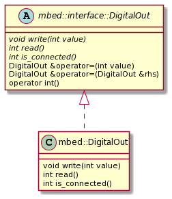
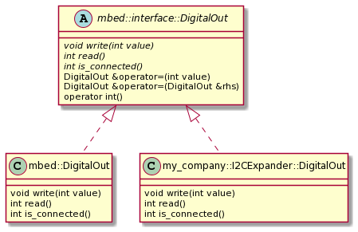

# Drivers overview

Drivers provide access to general purpose microcontroller hardware. Drivers typically access a microcontroller's hardware peripherals directly, and may form the lowest lever of a protocol or network stack.

The Mbed OS driver APIs include analog and digital inputs and outputs on development boards, as well as digital interfaces, which allow your board to interface with a computer or external devices. With these drivers, you can read or set the voltage of analog pins, control digital pins individually or grouped into a bus and trigger an event when more data is available on the bus. You can also control the frequency and mark to space ratio, or duty cycle, of a Pulse Width Modulated (PWM) digital output.

## Blocking nature

By default, all Mbed OS driver APIs are blocking. In the drivers, blocking APIs cause the current thread to wait until the hardware operation completes. Blocking APIs simplify control flow, allow for linearly structured programs and make debugging intuitive. We suggest using blocking APIs as a starting point. You should only consider more complex APIs if the blocking APIs do not satisfy your requirements.

Mbed OS is built around an RTOS, and to complement this, the drivers are thread safe. This means that if you use multiple drivers in a blocking manner, as long as the drivers are in separate threads, their operations can still be carried out in parallel. When a driver blocks a thread, the RTOS either switches to any nonblocked threads or sleeps. This means that in most cases, an application using blocking APIs has the same advantages as one using nonblocking APIs.

In some cases, the drivers provide nonblocking APIs. These APIs configure hardware to run in the background of the processor, without blocking a thread. Nonblocking drivers signal through the attach function once the background operation is complete.

## Attaching callbacks to drivers

In Mbed OS, the standard API for asynchronous events is the attach function. You can use the attach function to attach a callback function. Drivers call the attached callback function during specific events. You can use this to learn when the state of a nonblocking operation changes or whether other asynchronous events occur.

For example, you can attach a callback function on a [Serial](serial.html) object, which the Serial object calls when the serial line receives a packet on the RX line.

One important thing to note is that when you attach callbacks with this function, the driver calls them in interrupt context. Interrupt context runs at a higher priority than any thread, which means that any code called from the attach callback must be interrupt safe. This excludes any blocking APIs such as blocking drivers, malloc, and mutexes. Or you risk preventing other high-priority interrupts from running, which may break other parts of the OS.

When you need to call code that’s not interrupt safe from interrupt context, you must first defer from the interrupt context to a thread. The easiest way to defer to a thread is to signal a waiting thread through a [Semaphore](semaphore.html). In more complex use cases, you can use an [EventQueue](eventqueue.html) to manage multiple events at once.

## Experimental: Driver Interfaces and Polymorphism

**Please note: Polymorphic driver interfaces are still experimental and must be manually enabled by adding the `EXPERIMENTAL_API` feature to your project in your application configuration.**

### Motivation and Overview

Mbed driver APIs are intended to provide a solid foundation upon which to build cross-platform third-party libraries and higher level device drivers. With this goal in mind, an experimental feature has been introduced into Mbed's driver API hierarchy: **interfaces and polymorphism**

Previously, polymorphism and virtual inheritance have been avoided in Mbed's core hardware driver APIs due to the potential memory and speed implications. Virtual inheritance adds virtual tables (vtables) to each inheriting class; this results in a slightly larger memory footprint for each instance of a virtual class. Not only this, but when a method is being called on a pointer to a virtual class (and therefore the concrete type of the underlying object is not known at compile time), there is an additional runtime step involved where the correct virtual method must be looked up in the class's vtable. In some high speed use cases, this added latency can be unacceptable.

With the introduction of C++11, the language now has features to help optimize the above situtation. Namely, the `final` keyword. 

Subclasses inheriting from virtual base classes may now be marked `final`, which seals them from further inheritance. This allows the compiler to optimize calls to virtual methods in some cases, including inlining and removing the vtable lookup entirely. It must be stressed that this _can_ eliminate the vtable lookup and associated latency, but ultimately it is up to the compiler to do so.

Unfortunately, at time of writing, toolchain support for pruning unused vtables is not widely supported and so the memory usage increase associated with virtual inheritance is unavoidable. This is the primary reason Mbed's developers have decided to make this feature experimental and disabled by default. For some very memory-constrained targets this memory usage increase would be unacceptable.

### Using Driver Polymorphism in Your Code

Even though this feature is still experimental, you can start writing code that takes advantage of driver polymorphism now.

As an example use case, consider the scenario where your target has a limited number of internal GPIO available. You have run out of GPIO but need to control an RGB LED for user feedback. Now, your hardware team is very smart, and they've solved the problem for you: they've added an external GPIO expander IC that's accesible over I2C! You've already developed a very well tested and complex LED animation library but it has a structure like so:

```
class LEDAnimator {

    LEDAnimator(PinName red, PinName green, PinName blue) :_red(red), _green(green), _blue(blue) { ... }
    
private:
    mbed::DigitalOut _red;
    mbed::DigitalOut _green;
    mbed::DigitalOut _blue;

}
```

As it is now, your library only supports using internal GPIO. This obviously won't work with the external GPIO expander IC!

Previously, your only options were:

1. Rewrite your animation library to use the I2C-based GPIO expander. This creates an entirely separate fork of your library to maintain in the best case.
2. Add extra code to conditionally handle the case where your library is using an external I2C-connected GPIO expander rather than internal GPIO. This complicates your library and makes the code much less readable. Additionally, what happens when your hardware team uses a SPI-connected GPIO expander in the next design?

With driver polymorphism, the problem is much easier to solve.

When enabled, supported drivers will inherit from a driver **interface**:

<span class="images">

Note that some behavior _is_ defined in the interface itself, namely, some operators. These operators are defined here to make it intuitive to use _all_ implementations of a given driver interface, even when mixing them together. 

You can always evaluate a `mbed::interface::DigtialOut` as an `int` (which returns the state of the output), and you can always assign the value of one `mbed::interface::DigitalOut` to another `mbed::interface::DigitalOut` in an intuitive manner using the assignment "=" operator.

Let's get back to the above example. What you can do now, with driver polymorphism, is make it possible for your external I2C-connected GPIO expander to _act like_ a `DigitalOut` and _be compatible_ with any API that uses `mbed::interface:DigitalOut`:

<span class="images">

This hierarchy minimizes the changes you need to make to your existing library.

The recommended pattern for designing 3rd-party libraries that take advantage of driver polymorphism is to use _pointers_ to the _interface_ of the driver you're using. For example, we can refactor the `LEDAnimator` class to the following:

```c++
class LEDAnimator {

    /**
     * Optional constructor to maintain backwards compatibility. This constructor
     * dynamically allocates its own DigitalOut instances internally.
     */
    LEDAnimator(PinName red, PinName green, PinName blue) : _internally_created(true) {
        _red = new mbed::DigitalOut(red);
        _green = new mbed::DigitalOut(green);
        _blue = new mbed::DigitalOut(blue);
    }

    LEDAnimator(mbed::interface::DigitalOut *red, mbed::interface::DigitalOut *green, mbed::interface::DigitalOut *blue) : _red(red), _green(green), _blue(blue), _internally_created(false) {
    ...
    }
    
    ~LEDAnimator() {
        // Make sure to delete the instances if they were dynamically allocated!
        if(_internally_created) {
            delete _red;
            delete _green;
            delete _blue;
        }
    }
    
private:
    mbed::interface::DigitalOut *_red;
    mbed::interface::DigitalOut *_green;
    mbed::interface::DigitalOut *_blue;

    bool _internally_created;
}
```

Now it is possible for your existing library to use the external GPIO expander without any knowledge that it is external. As long as your `my_company::I2CExpander::DigitalOut` class implements the `mbed::interface::DigitalOut` interface properly, your code will work as it did before. You can even have some of the GPIO be internal or external if your design calls for it!

### Backwards Compatibility

Since driver polymorphism is still experimental, it is disabled by default. Therefore, Mbed's developers have been careful to make sure any code using the existing, non-polymorphic driver classes is not affected by the introduction of this new class hierarchy.

The inheritance of a driver from the new driver interface is conditional upon `FEATURE_EXPERIMENTAL_API` being added to your project's configuration. However, it is still possible for you to develop APIs now that are compatible with both polymorphic and non-polymorphic drivers.

When `FEATURE_EXPERIMENTAL_API` is disabled, the following type alias is made instead:

```c++
using mbed::interface::DigitalOut = mbed::DigitalOut;
```

This allows your new code library to be compiled with or without driver polymorphism enabled, since `mbed::interface::DigitalOut` will just fall back to the familiar, unpolymorphic `mbed::DigitalOut`.

### Design Considerations and Caveats

As mentioned before, virtual inheritance and polymorphism _do_ have an impact on the resulting binary. For extremely constrained targets, you can optimize away a bit of memory consumption by disabling driver polymorphism (which is currently the default). Then there is the impact on execution speed that can result from virtual inheritance.

In some cases, such as a software ("bit-banged") UART implementation or similar, a small change in execution speed can have disastrous effects on your code's timing.

Fortunately, you can still take advantage of driver polymorphism _and_ maintain high speed operation when you need it.

When driver polymorphism is enabled, Mbed's driver implementations are marked `final`. This accomplishes two things: 

1. It prevents any further inheritance from the `final` class. 
2. It hints to the compiler that a pointer or reference to this class will never point to anything but an instance of this class.

The latter effect allows us to minimize the impact of virtual inheritance on execution speed in some cases. If the compiler knows the concrete type of the driver object at runtime, it _may_ eliminate or inline the vtable redirection. In our testing, we have seen this optimization result in _no speed hit_ when toggling a pin on and off in a while loop. Your results may vary depending on your target's HAL implementation, however.

To improve the compiler's ability to optimize calls to a polymorphic driver in this way, you should use the following guidelines when designing your 3rd-party libraries:

When your library **does not** have any high speed requirements, you should use a pointer/reference to the _driver interface_ (eg: `mbed::interface::DigitalOut*`). This gives your library maximum flexibility by allowing it to use polymorphic subtypes of the given interface.

When your library **does** have high speed requirements (such as the "bit-banged" example mentioned previously), you should use a pointer/reference to Mbed's driver implementation type _directly_ (eg: `mbed::DigitalOut*`). Since the compiler knows the concrete type is Mbed's implementation (which is `final`), it _may_ inline calls to that type, maintaining the execution speed possible with polymorphism disabled.
