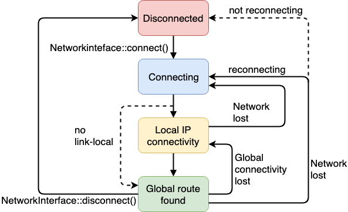

<h1 id="network-status">Network status</h1>

This interface informs you about connection state changes asynchronously. Providing a method to register a callback function to a socket accomplishes this. Each time the network interface's state changes, it triggers the callback.



## Usage

The callback needs to handle these possible network states:

```cpp NOCI
/** Enum of connection status types
 *
 *  Valid error codes have negative values.
 *
 *  @enum nsapi_connection_status
 */
 typedef enum nsapi_connection_status {
    NSAPI_STATUS_LOCAL_UP,            /*!< local IP address set */
    NSAPI_STATUS_GLOBAL_UP,           /*!< global IP address set */
    NSAPI_STATUS_DISCONNECTED,        /*!< no connection to network */
    NSAPI_STATUS_CONNECTING,          /*!< connecting to network */
    NSAPI_STATUS_ERROR_UNSUPPORTED  = NSAPI_ERROR_UNSUPPORTED
} nsapi_connection_status_t;
```

This API requires an interface to be monitored. For example, Ethernet:

```cpp NOCI
EthernetInterface eth;
```

You need to provide the callback function, for example:

```cpp NOCI

bool is_connected = false;

void status_callback(nsapi_event_t status, intptr_t param)
{
    if (status == NSAPI_EVENT_CONNECTION_STATUS_CHANGE) {
        switch(param) {
            case NSAPI_STATUS_GLOBAL_UP:
                if (!is_connected) {
                    start_my_cloud_client();
                    is_connected = true;
                }
                break;
            default:
                if (is_connected) {
                    stop_my_cloud_client();
                    is_connected = false;
                }
                break;
        }
    }
}
```

Now, the callback function is registered to the interface.

```cpp NOCI
    eth.attach(&status_callback);
```

This allows the application to monitor if network interface gets disconnected.

Optionally, the application might want to set the `connect()` method to nonblocking mode and wait until connectivity is fully established.

```cpp NOCI
    eth.set_blocking(false);
    eth.connect();              // Return immediately
```

By default, the `connect()` call blocks until `NSAPI_STATUS_GLOBAL_UP` state is reached. Some applications might require only link-local connectivity and therefore do not need to block that long. In those case monitoring the state changes is the preferred behavior.

## Using multiple connection status callbacks

The NetworkInterface API includes two functions that the applications can use to register more than one status callback for each network interface:

```
    /** Add event listener for interface.
     *
     * This API allows multiple callback to be registered for a single interface.
     * When first called, an internal list of event handlers is created and registered to
     * interface through attach() API.
     *
     * The application may only use the attach() or add_event_listener() interface. Mixing use
     * of both leads to undefined behavior.
     *
     *  @param status_cb The callback for status changes.
     */
    void add_event_listener(mbed::Callback<void(nsapi_event_t, intptr_t)> status_cb);

    /** Remove event listener from interface.
     *
     * Remove previously added callback from the handler list.
     *
     *  @param status_cb The callback to unregister.
     */
    void remove_event_listener(mbed::Callback<void(nsapi_event_t, intptr_t)> status_cb);
```

The callback prototype is the same as that for the `NetworkInterface::attach()`.

The `NetworkInterface::attach()` is still functional, and it is a porting API that each interface should provide. The functions above use `NetworkInterface::attach()` internally, so the application cannot use both at the same time.

You must either refactor the application by replacing `NetworkInterface::attach()` calls with `NetworkInterface::add_event_listener()`, or the application must remain using the `NetworkInterface::attach()`.

This optional and has a small RAM and ROM increase, so applications are not required to use it. Both APIs are still supported, but use is limited to one at a time.

## Example

Registering a status callback that connection state changes trigger depends on whether the network interface provides this functionality.

[](https://os.mbed.com/teams/mbed_example/code/TCPSocket_ConnStateCb_Example/file/c66df92cf71b/main.cpp)

## Related content

- [Network socket](network-socket.html) API reference overview.
