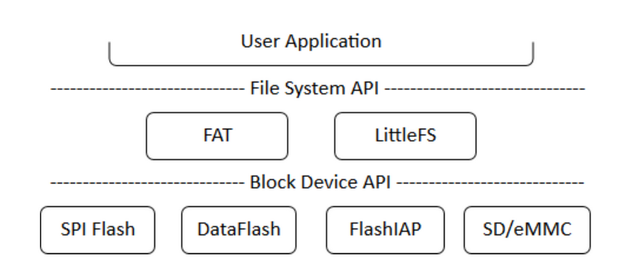

<h1 id="blockdevice-port">Block Devices</h1>

Block devices are the basic building block of storage solutions in Mbed OS.



File systems are backed by [blockdevice implementations](../apis/blockdevice.html). The BlockDevice API performs the low-level interactions with the hardware storage. To add your own block device implementation, we recommend you inherit from the BlockDevice class. For details on how to extend the BlockDevice interface, please refer to the and [implementing BlockDevice](#implementing-blockdevice) section below.

## Assumptions

### Defined behavior

- Erase leaves memory as undefined. It does not set memory to a predetermined value.

### Undefined behavior

- Programming without erase is undefined behavior.

### Notes


Erase, program and read block sizes may not be the same; however, they must be multiples of one another.

## Implementing BlockDevice

You can find the BlockDevice class on the master branch under the `features/storage/blockdevice` path in Mbed OS.

[](https://os.mbed.com/docs/v5.13/mbed-os-api-doxy/classmbed_1_1_block_device.html)

The primary functions to implement are:

- `int read(void *buffer, bd_addr_t addr, bd_size_t size);`
- `int program(void *buffer, bd_addr_t addr, bd_size_t size);`
- `int erase(bd_addr_t addr, bd_size_t size);`

## Testing

You can run BlockDevice tests for heap, MBR and util block devices with the following command:

```
mbed test -t <toolchain> -m <target> -n features-tests-filesystem-*_block_device
```

You can run BlockDevice tests without the file system with the following command:

```
mbed test -t <toolchain> -m <target> -n mbed-os-features-storage-tests-blockdevice-general_block_device -v
```

One way to add tests for new block devices is to copy an existing implementation, such as HeapBlockDevice, and change the block device class to your own. You can find tests under the top level `TESTS` folder in the Mbed OS repository.
