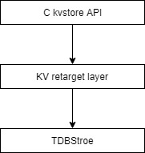
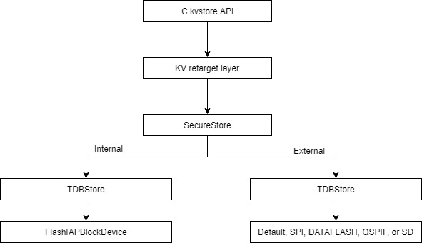
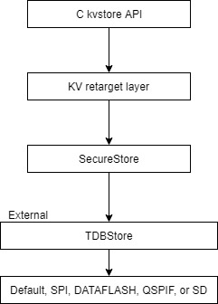
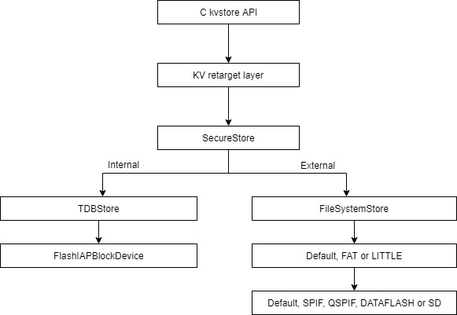
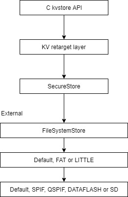

# Storage

This page describes the build-time configurable parameters for storage in Mbed OS:

- [KVStore configuration](#kvstore-configuration).
- [LittleFS configuration](#littlefs-configuration).
- [NVStore configuration](#nvstore-configuration).
- [Default BlockDevice configuration](#Default-BlockDevice-configuration).
- [Default FileSystem configuration](#Default-FileSystem-configuration).

## KVStore configuration

Mbed OS provides a storage solution based on the KVStore API. Different components that implement the KVStore API are allocated and configured to support the [global API](../apis/static-global-api.html).

The configuration of the KVStore storage solution is composed of two levels:

- Use the top level `mbed_lib.json` to selet the predefined configuration by setting the parameter `storage_type`.
- Use the subfolder `mbed_lib.json` for each configuration to fine tune the relevant parameters for the selected configuration.

### Configuration structure

```
kvstore
│
└───conf
    │   mbed_lib.json
    │
    ├───tdb_external
    │       mbed_lib.json
    │
    ├───tdb_external_no_rbp
    │       mbed_lib.json
    │
    ├───filesystem
    │       mbed_lib.json
    │
    ├───filesystem_no_rbp
    │       mbed_lib.json
    │
    └───tdb_internal
            mbed_lib.json
```

The KVStore configuration file structure includes six configuration files. You can use the topmost configuration file to set up the full configuration of the storage by defining a single parameter (`storage_type`) to one of the predefined configurations. You can use the configuration files in the subfoldersto implement the above top level configurations.

You can find the configuration files under `conf/<configuration name>`:

- `conf/tdb_internal` - The storage type `TDB_INTERNAL` configuration is intended to be used when all data will be stored in internal memory only. There is no need for additional security features. A single TDBStore object will be allocated in internal flash.
- `conf/tdb_external` - The storage type `TDB_EXTERNAL` configuration provides full security and is intended to be used when data is stored in external flash. It allocates: SecureStore, TDBStore in external flash and TDBStore in internal flash for rollback protection (RBP).
- `conf/tdb_external_no_rbp` - The storage type `TDB_EXTERNAL_NO_RBP` configuration allows security but without rollback protection. This is similar to `tdb_external` but without the TDBStore in internal memory.
- `conf/filesystem` - This configuration allocates SecureStore, FileSystemStore, filesystem, TDBStore in internal memory and the required block devices. The allocated file system is selected according to the COMPONENT set in `targets.json` (FATFS for SD card and LITTLEFS for SPIF). However, you can set this differently by overriding the respective parameter. Use this configuration if you need the file system with the POSIX API in addition to the set/get API.
- `conf/filesystem_no_rbp` - The storage type `FILESYSTEM_NO_RBP` configuration allows security like the FILESYSTEM configuration but without rollback protection.

A standalone block device is allocated for each component in internal and external memory and SD cards as required for the configurations. The full size of the memory allocated for each block device will be used by the respective component.

### Configuration parameters

The following is a list of all storage parameters available and their descriptions:

- `storage_type` - Used to select one of the predefined configurations.
   - `TDB_INTERNAL`.
   - `TDB_EXTERNAL`.
   - `TDB_EXTERNAL_NO_RBP`.
   - `FILESYSTEM`.
   - `FILESYSTEM_NO_RBP`.
- `default_kv` - This string represents the path for the default KVStore instantiation. Applications can pass an empty path (only the key name) or pass the generated name for this parameter (`MBED_CONF_STORAGE_DEFAULT_KV`) as the path to use this configuration.
- `internal_size` - The size in bytes for the internal FlashIAP block device. This, together with the `internal_base_address`, adjusts the size and location where the block device resides on memory. If not defined, the block device uses the maximum size available.
- `internal_base_address` - The address where the internal FlashIAP blockDevice starts. This helps to prevent collisions with other needs, such as firmware updates. If this is not defined, the start address is set to the first sector after the application code ends in `TDB_internal`. In any external configurations with rollback protection support, it will be set to end of flash - `rbp_internal_size`.
- `rbp_number_of_entries` - This sets the number of entries allowed for rollback protection. The default is set to 64. This parameter controls the maximum number of different keys that can be created with rollback protection flag.
- `rbp_internal_size` - This sets the size for the rollback protection of TDBStore in the internal memory. The base address is calculated as the flash ends address, or the size.
- `filesystem` - Options are FAT, LITTLE or default. If not set or set to default, the file system type will be selected according to the storage component selected for the board in the `targets.json` file: FAT for "components": ["SD"] and Littlefs for "components": ["SPIF"].
- `blockdevice` - Options are default, SPIF, DATAFLASH, QSPIF or SD. If the file system is set to default, this parameter is ignored.
- `external_size` - The size of the external block device in bytes. If this is not set, the maximum available size will be used.
- `external_base_address` - The start address of the external block device. If this is not set, 0 address will be used.
- `mount_point` - Mount point for the file system. This parameter will be ignored if the file system is set to default.
- `folder_path` - Path for the working directory where the FileSystemStore stores the data.

### Storage configuration

Below is the main storage configuration in the `mbed_lib json` file:

```
{
"name": "storage",
    "config": {
        "storage_type": {
            "help": "Options are TDB_INTERNAL, TDB_EXTERNAL, TDB_EXTERNAL_NO_RBP, FILESYSTEM or FILESYSTEM_NO_RBP.",
            "value": "NULL"
        },
        "default_kv": {
            "help": "A string name for the default kvstore configurtaion",
            "value": "kv"
        }
    }
}
```

### TDB_INTERNAL

Use this internal configuration for targets willing to save all the data in internal flash.

<span class="images"><span>`TDB_Internal`</span></span>

In this configuration, all KVStore C APIs will be mapped to the TDBStore in the internal flash. To use this configuration, set the `storage_type parameter` in `storage mbed_lib.json` to `TDB_INTERNAL`.

Below is the `TDB_INTERNAL` configuration in `mbed_lib.json`:

```
{
    "name": "storage_tdb_internal",
    "config": {
        "internal_size": {
            "help": "Size of the FlashIAP block device. default size will be from internal_base_address till the end of the internal flash.",
            "value": "0"
        },
        "internal_base_address": {
            "help": "If default, the base address is set to the first sector after the application code ends.",
            "value": "0"
        }
    }
}
```

For this configuration, please define the section of the internal storage that will be used for data, by defining these parameters in your `app.config` file: `internal_base_address` and `internal_size`. If not defined, the storage will start in the first sector immediately after the end of the application. This can reduce the ability to update the application with a bigger one.

### TDB_External

<span class="images"><span>`TDB_External`</span></span>

`TDB_EXTERNAL` uses a TDBStore in the internal flash for security rollback protection and a TDBStore on the external flash for the data.

In this configuration, all KVStore C API calls are mapped to work with the SecureStore class. This class handles the use of the two TDBStores. Unless configured differently, the external TDBStore will work on top of the default block device, and the internal TDBStore will work with the FlashIAPBlockdevice.

You can set the external TDBStore block device to any of the following block devices: SPIF, QSPIF, DATAFASH and SD.

You can enable this configuration by setting `storage_type` to `TDB_EXTERNAL` in `storage mbed_lib.json`.

Below is the `TDB_EXTERNAL` configuration in `mbed_lib.json`:

```
{
    "name": "storage_tdb_external",
    "config": {
        "rbp_internal_size": {
            "help": "Default is the size of the 2 last sectors of internal flash",
            "value": "0"
        },
        "internal_base_address": {
            "help": "If default, the base address is set to the first sector after the application code ends.",
            "value": "0"
        },
        "blockdevice": {
            "help": "Options are default, SPIF, DATAFASH, QSPIF, SD or other. If default the block device will be chosen by the defined component. If other, override get_other_blockdevice() to support block device out of Mbed OS tree.",
            "value": "default"
        },
        "external_size": {
            "help": "Size in bytes of the external block device, if default the maximum size available is used.",
            "value": "0"
        },
        "external_base_address": {
            "help": "The default will set start address to address 0",
            "value": "0"
        }
    }
}
```

### TDB_External_no_RBP

<span class="images"><span>`TDB_External_no_RBP`</span></span>

The `TDB_EXTERNAL_NO_RBF` configuration has no support for rollback protection and is therefore less secure.

The `TDB_EXTERNAL_NO_RBP` uses only one TDBStore on the external flash for all data. In this configuration, all KVStore C API calls are mapped to work with the SecureStore class. The external TDBStore will work on top of the default block device; however, you can set the external TDBStore block device to any of the following block devices: SPIF, QSPIF, DATAFASH and SD.

You can enable this configuration by setting `storage_type` to `TDB_EXTERNAL_NO_RBP` in `storage mbed_lib.json`.

Below is the `TDB_EXTERNAL_NO_RBP` configuration in `mbed_lib.json`:

```
{
    "name": "storage_tdb_external_no_rbp",
    "config": {
        "external_size": {
            "help": "Size in bytes of the external block device, if default the maximum size available is used.",
            "value": "0"
        },
        "external_base_address": {
            "help": "The default will set start address to address 0",
            "value": "0"
        },
        "blockdevice": {
            "help": "Options are default, SPIF, DATAFASH, QSPIF, SD or other. If default the block device will be chosen by the defined component. If other, override get_other_blockdevice() to support block device out of Mbed OS tree.",
            "value": "default"
        }
    }
}
```

### FILESYSTEM

<span class="images"><span>`FILESYSTEM`</span></span>

The `FILESYSTEM` configuration resembles the `EXTERNAL` with the difference that it uses FileSystemStore on the external flash. By default, FileSystemStore used the default file system and the default block device.

In this configuration, all KVStore C API paths are mapped to the SecureStore class. This class handles the use of the internal TDBStore or external FileSystemStore.

You can enable this configuration by setting `storage_type` to `FILESYSTEM` in `storage mbed_lib.json`.

Below is the `FILESYSTEM` configuration in `mbed_lib.json`:

```
{
    "name": "storage_filesystem",
    "config": {
        "rbp_internal_size": {
            "help": "Default is the size of the 2 last sectors of internal flash",
            "value": "0"
        },
        "internal_base_address": {
            "help": "If default, base address is the first sector after the application code",
            "value": "0"
        },
        "filesystem": {
            "help": "Options are default, FAT or LITTLE. If default value the filesystem is chosen by the blockdevice type",
            "value": "default"
        },
        "blockdevice": {
            "help": "Options are default, SPIF, DATAFASH, QSPIF, SD or other. If default, the block device will be chosen according to the component defined in targets.json. If other, override get_other_blockdevice() to support block device out of Mbed OS tree.",
            "value": "default"
        },
        "external_size": {
            "help": "Size in bytes of the external block device, if default value, the maximum size available is used.",
            "value": "0"
        },
        "external_base_address": {
            "help": "The default will set start address to address 0",
            "value": "0"
        },    
        "mount_point": {
            "help": "Where to mount the filesystem.",
            "value": "kv"
        },
        "folder_path": {
            "help": "Path for the working directory where the FileSystemStore stores the data",
            "value": "kvstore"
        }
    }
}
```

If the file system is not set, the default file system and block device will be applied, and `blockdevice`, `external_size` and `external_base_address` will be ignored.

### FILESYSTEM_NO_RBP

<span class="images"><span>`FILESYSTEM_NO_RBP`</span></span>

The `FILESYSTEM_NO_RBP` configuration resembles the `EXTERNAL_NO_RBP` with the difference that it uses FileSystemStore on the external flash. By default, FileSystemStore uses the default file system and the default block device. This configuration has no support for rollback protection and is therefore less secure.

In this configuration, all KVStore C API calls are mapped to the SecureStore class. This class handles the use of the external FileSystemStore.

You can enable this configuration by setting `storage_type` to `FILESYSTEM_NO_RBF` in `storage mbed_lib.json`.

Below is the `FILESYSTEM` configuration in `mbed_lib.json`:

```
{
    "name": "storage_filesystem_no_rbp",
    "config": {
        "filesystem": {
            "help": "Options are default, FAT or LITTLE. If default value the filesystem is chosen by the blockdevice type",
            "value": "default"
        },
        "blockdevice": {
            "help": "Options are default, SPIF, DATAFLASH, QSPIF, SD or other. If default the block device will be chosen by the defined component. If other, override get_other_blockdevice() to support block device out of Mbed OS tree.",
            "value": "default"
        },
        "external_size": {
            "help": "Size in bytes of the external block device, if default the maximum size available is used.",
            "value": "0"
        },
        "external_base_address": {
            "help": "The default will set start address to address 0",
            "value": "0"
        },    
        "mount_point": {
            "help": "Where to mount the filesystem.",
            "value": "kv"
        },
        "folder_path": {
            "help": "Path for the working directory where the FileSystemStore stores the data",
            "value": "kvstore"
        }
    }
}
```

If the file system is not set, the default file system and block device will be applied, and `blockdevice`, `external_size` and `external_base_address` will be ignored.

### Configuration functions API

Applications must call the function **storage_configuration()** to instantiate the required configuration. This function is defined as weak to allow the replacement of this function with a completely different implementation of the instantiation of components:

```
MBED_WEAK bool storage_configuration()
{
    return _STORAGE_CONFIG(MBED_CONF_STORAGE_STORAGE_TYPE);
}
```

### Override user-defined setup

To create a much more complex setup, including using other block devices, such as MBRBlockDevice or SlicingBlockDevice, you need to override the `storage_configuration` function and generate any storage configuration.

## LittleFS configuration

LittleFS provides several configuration options that you can use to tweak the performance of the file system on different hardware. By default, this file system finds the optimal configuration from the underlying block device's geometry, but you can override this to optimize special situations. For example, if your device has a large amount of RAM, you can increase the `read_size` and `prog_size` configuration options for a minor speed improvement.

Note that LittleFS has 4 levels of debug logging. By default, all logging is enabled except for `enable_debug`. Setting `enable_debug` to `true` makes the log output very verbose, and the output is useful for bug reports.

```
Configuration parameters
------------------------
Name: littlefs.block_size
    Description: Size of an erasable block. This does not impact ram consumption and may be larger than the physical erase size. However, this should be kept small as each file currently takes up an entire block.
    Defined by: library:littlefs
    Macro name: MBED_LFS_BLOCK_SIZE
    Value: 512 (set by library:littlefs)
Name: littlefs.enable_assert
    Description: Enables asserts, true = enabled, false = disabled, null = disabled only in release builds
    Defined by: library:littlefs
    No value set
Name: littlefs.enable_debug
    Description: Enables debug logging, true = enabled, false = disabled, null = disabled only in release builds
    Defined by: library:littlefs
    No value set
Name: littlefs.enable_error
    Description: Enables error logging, true = enabled, false = disabled, null = disabled only in release builds
    Defined by: library:littlefs
    No value set
Name: littlefs.enable_info
    Description: Enables info logging, true = enabled, false = disabled, null = disabled only in release builds
    Defined by: library:littlefs
    No value set
Name: littlefs.enable_warn
    Description: Enables warn logging, true = enabled, false = disabled, null = disabled only in release builds
    Defined by: library:littlefs
    No value set
Name: littlefs.intrinsics
    Description: Enable intrinsics for bit operations such as ctz, popc, and le32 conversion. Can be disabled to help debug toolchain issues
    Defined by: library:littlefs
    Macro name: MBED_LFS_INTRINSICS
    Value: 1 (set by library:littlefs)
Name: littlefs.lookahead
    Description: Number of blocks to lookahead during block allocation. A larger lookahead reduces the number of passes required to allocate a block. The lookahead buffer requires only 1 bit per block so it can be quite large with little ram impact. Should be a multiple of 32.
    Defined by: library:littlefs
    Macro name: MBED_LFS_LOOKAHEAD
    Value: 512 (set by library:littlefs)
Name: littlefs.prog_size
    Description: Minimum size of a block program. This determines the size of program buffers. This may be larger than the physical program size to improve performance by caching more of the block device.
    Defined by: library:littlefs
    Macro name: MBED_LFS_PROG_SIZE
    Value: 64 (set by library:littlefs)
Name: littlefs.read_size
    Description: Minimum size of a block read. This determines the size of read buffers. This may be larger than the physical read size to improve performance by caching more of the block device.
    Defined by: library:littlefs
    Macro name: MBED_LFS_READ_SIZE
    Value: 64 (set by library:littlefs)
```

## NVStore configuration

NVStore does not need much configuration. It relies only on the regions of internal flash specified in the `area_*_address` and `area_*_size` for the two areas. Additionally, you can use `max_keys` to manage the amount of RAM NVStore keys needs. Note that `max_keys` defaults to the number of keys Mbed OS needs. You only need to modify it if an application uses NVStore directly.

```
Configuration parameters
------------------------
Name: nvstore.area_1_address
    Description: Area 1 address
    Defined by: library:nvstore
    No value set
Name: nvstore.area_1_size
    Description: Area 1 size
    Defined by: library:nvstore
    No value set
Name: nvstore.area_2_address
    Description: Area 2 address
    Defined by: library:nvstore
    No value set
Name: nvstore.area_2_size
    Description: Area 2 size
    Defined by: library:nvstore
    No value set
Name: nvstore.enabled
    Description: Enabled
    Defined by: library:nvstore
    Macro name: NVSTORE_ENABLED
    Value: 1 (set by library:nvstore)
Name: nvstore.max_keys
    Description: Maximal number of allowed NVStore keys
    Defined by: library:nvstore
    Macro name: NVSTORE_MAX_KEYS
    Value: 16 (set by library:nvstore)
```

## BlockDevice - default configuration

The Mbed OS configuration allows you to add block devices as components using the `targets.json` file or target overrides in the application configuration file.

When [one of the following components](https://cloud.mbed.com/docs/latest/connecting/mbed-os-storage-configuration.html) is enabled, a default block device is set in the system ("components": ["xxx","yyy"]):

1. SPIF
1. QSPIF
1. DATAFLASH
1. SD
1. FLASHIAP

Components can coexist in the system. A device can have SPIF and SD or any combination of block devices enabled but only one default block device.

The list above is in the order of precedence shows which block device is the default one if more than one component is enabled.

### Configuring components

For example, the following entry in `targets.json` enables the SD component:

```
 "K64F": {
        "components": ["SD"],
        "core": "Cortex-M4F",
        "supported_toolchains": ["ARM", "GCC_ARM", "IAR"],
        "inherits": ["Target"],
        "features": ["STORAGE"],
        "release_versions": ["2", "5"],
        ...
     },
```

The following `mbed_app.json` snippet enables the SPI flash component when compiling for the MTB_ADV_WISE_1570 target:

```     
"target_overrides": {
    "MTB_ADV_WISE_1570": {
         "target.components_add": ["SPIF"]
    }
}
```

Please note that while a default block device exists, an application is not forced to use it and can create its own one.

Enabling the storage feature, SD component, and overriding the default pins can be done within `mbed_app.json`. Using the NRF52_DK target as an example:

```
"target_overrides": {
    "NRF52_DK": {
         "target.features_add": ["STORAGE"],
         "target.components_add": ["SD"],
         "sd.SPI_MOSI": "D11",
         "sd.SPI_MISO": "D12",
         "sd.SPI_CLK": "D13",
         "sd.SPI_CS": "D10"
    }
}
```

These values override the default pins assigned to the parameters: `MBED_CONF_SD_SPI_MOSI`, `MBED_CONF_SD_SPI_MISO`, `MBED_CONF_SD_SPI_CLK` and `MBED_CONF_SD_SPI_CS` present within the `mbed_lib.json` file for the SD component in Mbed OS.

### Overriding default block device implementation

The get default instance is implemented as [MBED_WEAK](https://github.com/ARMmbed/mbed-os/blob/40058871de290edc758a21ae6d8f2ec1d1b3533d/platform/mbed_toolchain.h#L120) at `features/storage/system_storage/SystemStorage.cpp`. That means that can override it by implementing the function without `MBED_WEAK` and change the default block device for a given application.

```
#include "HeapBlockDevice.h"

BlockDevice *BlockDevice::get_default_instance()
{
    static HeapBlockDevice default_bd(32 *1024);
    return &default_bd;
}
```

## FileSystem - default configuration

The Mbed OS configuration allows you to add block devices as components using the `targets.json` file or target overrides in the application configuration file. When you configure a component of SPIF, DATAFLASH or SD, the system supports one default file system.

Please note that while a default file system exists, an application is not forced to use it and can create its own one.

The default file system is created based on the default block device due to performance considerations.

SPIF and DATAFLASH block devices support the Little file system, and the SD block device supports the FAT file system. However, the application can ovveride this behavior.

### Overriding default block device implementation

The get default instance is implemented as `MBED_WEAK` at `features/storage/system_storage/SystemStorage.cpp`. That means you can overridde it by implementing the function without `MBED_WEAK` and change the default block device for a given application.

The following example overrides the get default instance of and always returns a FAT file system regardless of the block device type:

```
#include "FATFileSystem.h"

FileSystem *FileSystem::get_default_instance()
{
    static FATFileSystem default_fs("fs" BlockDevice::get_default_instance());

    return &default_fs;
}

```
