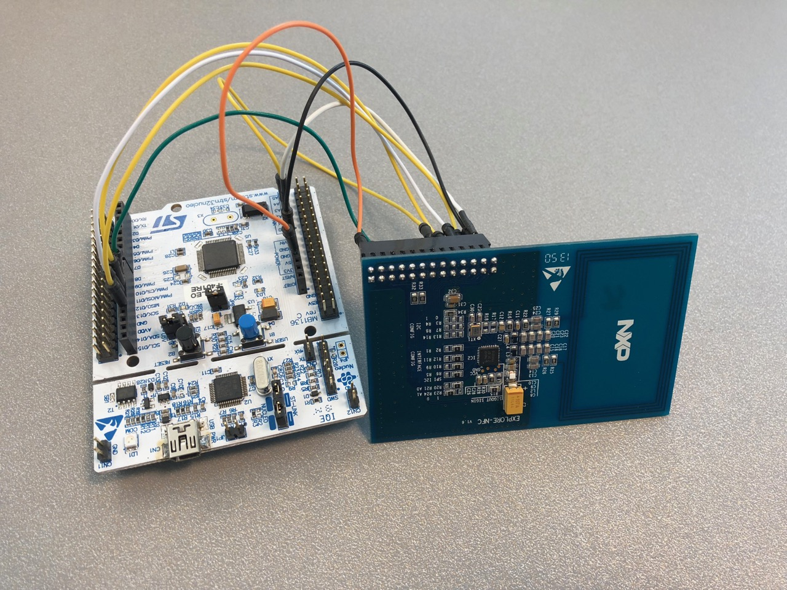

<h1 id="nfc-technology">NFC</h1>

NFC stands for Near-Field Communication and is a short-range radio technology. You can use it to enable use cases such as contactless payments, access control and device pairing.

N Mark

You can find more details on NFC about the [NFC Forum's website](https://nfc-forum.org/what-is-nfc/).

## NFC support in Mbed OS

Historically, NFC encompasses multiple protocols. NFC support in Mbed OS is based on the specifications the [NFC Forum](https://nfc-forum.org/our-work/specifications-and-application-documents/specifications/nfc-forum-technical-specifications/) publishes.

NFC offers three modes:

1. NFC card emulation.
1. NFC reader or writer.
1. NFC peer to peer.

Mbed OS supports the card emulation mode, either through the use of a controller or NFC EEPROM.

NFC support is available for the NXP PN512 transceiver. In terms of NFC EEPROMs, a driver for the ST M24SR EEPROM series is available - we also provide a [porting guide](../porting/NFC-port.html) to add support for other NFC EEPROMs.

We also provide APIs to decode and encode NDEF messages. A NDEF message is a standardized encoding that most NFC devices, such as Android and iOS smartphones, can understand.

An NFC EEPROM can read from and write to a NDEF message. A NFC initiator can access the message through the NFC interface the EEPROM exposes.

The NFC Forum defines 5 Tag specifications, which define how to transmit and receive NDEF messages on top of various NFC technologies.

When using a controller, the Mbed OS NFC Framework can implement the [Type 4 Tag platform](https://nfc-forum.org/our-work/specifications-and-application-documents/specifications/tag-type-technical-specifications/). This means that the initiator can gnerate NDEF messages dynamically before each read and parse it after each write.

## NFC controllers and NFC EEPROMs

These components address different use cases, and you need to consider two factors: cost and functionality.

Most NFC controllers implement many modes of NFC and offer flexibility; however, they are typically more expensive than NFC EEPROMs.

NFC controllers typically support a large subset (if not all) of NFC Forum functionality, can act as either initiators or targets and are driven by an external stack. In Mbed OS, this means that you can generate NDEF messages "on demand" when the initiator reads them.

NFC EEPROMs behave like NFC tags whose memory can either be addressed through a wired (such as I2C) or NFC air interface. One benefit is that these work autonomously from a microcontroller. Some of them can also use the NFC field as a power source if they are powered off at the time.

## Getting started with NFC and example

NFC examples are available on [GitHub](https://github.com/ARMmbed/mbed-os/tree/master/docs/design-documents/nfc) and demonstrate how to create NFC tags that you can be read from and write to using a phone.

An Explore-NFC board attached to a Nucleo board

## API

There are two entrypoints for the API, depending on whether you are using a NFC Controller or EEPROM.

You must initiate either entry point with a driver instance, an event queue and a scratch buffer for NDEF messages.

## Design

A detailed design document is available [within the Mbed OS source tree](https://github.com/ARMmbed/mbed-os/blob/master/docs/design-documents/nfc/nfc_design.md). It details the rationale behind the API design.
