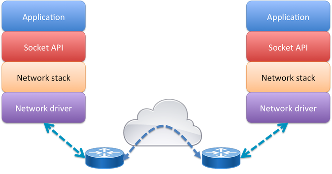

<h1 id="connectivity-tech">Network connectivity in Mbed OS</h1>

## Supported connectivity technologies

Mbed OS offers a strong, integrated stack of standards-based technologies:

For IP devices:

- Cellular.
- NB-IoT.
- Thread.
- Wi-SUN.
- 6LoWPAN-ND.
- Bluetooth Low Energy (BLE).

Non-IP devices require a gateway:

- LoRaWAN.
- Cellular.

## Choosing your connectivity method

There is a wide variety of possibilities for connected devices, and there is no globally correct connectivity method. Choose a method that fits your application needs, and then choose a device that can support that method. If you're already committed to a device type, you may need to adjust your application to work within that device's connectivity constraints.

## Internet protocol (IP) networking

Mbed OS supports various IP-based connectivity options and IP stacks.

Connectivity stack architecture in Mbed OS

Our Socket API standardizes all of our connectivity options. It supports both IPv4 and IPv6. Applications are portable regardless of final connectivity option.

Mbed OS provides network drivers, such as Ethernet, Wi-Fi and cellular.

### Wi-Fi

Wi-Fi has a relatively high throughput of up to 1 Gbps, which is suitable for data-heavy applications. The cost of this throughput is high power consumption. Wi-Fi is not ideal for long-term deployments of battery-powered devices. It can also prove problematic where other devices compete for the same bandwidth.

It works for proof-of-concept devices because the infrastructure is in place in most offices, and its WPA2 security is familiar to developers.

End devices for Wi-Fi are complicated due to hardware requirements and limitations. The network cost depends on whether the deployment location already includes a well-maintained Wi-Fi infrastructure. Wi-Fi is ubiquitous indoors, and Wi-Fi devices have a range of tens of meters, so for certain applications, such as those for homes and offices, the infrastructure likely already exists.

### Cellular

Cellular has a variable throughput, reaching 10 Mbps. Its coverage is extensive, and its range is 25-100 km, so it is commonly used in transportation and logistics. It is also well suited for proof of concept, because, like Wi-Fi, it relies on an existing infrastructure. It's suitable for many use cases, from monitoring temperature sensors to streaming video.

Cellular coverage, load balancing and reliability are the responsibility of the providers, not the application. However, network access is subscription based, so there is a direct correlation between use and cost.

The new cellular technologies, NB-IoT and CAT-M1, are designed for IoT devices. They offer some advantages, but there are also risks and costs.

**Narrow-band-IoT** (NB-IoT) relies on a simple waveform and therefore requires the lowest power consumption of all the cellular methods. It also has fewer components and offers better signal penetration through walls (thanks to lower bitrates and better link budgets). NB-IoT requires country-specific chips because each country uses its own spectrum, which complicates production. It also causes problems with large transfers because of its reduced bandwidth.

**CAT-M1** has a higher data rate than NB-IoT (closer to existing cellular behavior) but is not proven to be more power efficient. Any efficiency gains can be lost because of operator configurations.

It can be deployed on a single spectrum, reducing antenna configuration complexity, but isn't deployed worldwide and can take years to be deployed in countries using 3G.

### Bluetooth Low Energy (BLE)

BLE is optimized for cheap, battery-based devices and has a low memory footprint. It is widely adopted for connected spaces but requires setting up an infrastructure. Its range is up to 100 meters, with 1 mbps bandwidth. You need an edge gateway, so devices in your network can connect to the internet.

Typical applications of BLE are health care, fitness trackers, beacons, smart homes, security, entertainment, proximity sensors, industrial applications and automotives.

To learn how to use BLE on Mbed OS, please refer to the [Bluetooth overview](../apis/ble.html).

### 6LoWPAN Mesh 

Mesh networks are designed to form IPv6 networks automatically for a larger area than is possible with single radio link. TDifferent protocols form flexible network topology using different design principles. As a technology designed for large-scale deployment, 6LoWPAN-based mesh is optimized for long battery life and low cost.

**Thread** is designed for fast and robust communication between devices and internet that needs to react quickly on changing environmental or application conditions. Thread networks are self-healing with no single point of failure. They are suitable for example to home automation and lightning control solutions because of the expense in infrastructure setup and maintenance.

**Wi-SUN** and **6LoWPAN-ND** are designed to be reliable on changing frequency environments. Typically they are communicating with some backend server.

Data rates in the mesh networks range depending on regulations from 50 kbps to 300 kbps and can be run from sub-GHz to 2.4 GHz using 802.15.4 radios.

6LoWPAN is a compression method for IPv6 packets. Mbed OS supports Wi-SUN, 6LoWPAN-ND and Thread protocols for forming IPv6-based mesh networks. All protocols use the same 6LoWPAN compression method but different routing protocols to achieve a wireless mesh network. Applications running on 6LoWPAN-based mesh networks use the same Mbed OS Socket API for connectivity.

Additionally, Mbed OS Thread stack is certified using predefined test sets for stability, reliability and performance to ensure high-quality, production-ready delivery for application and product creation.

[Mesh tutorial](../tutorials/mesh-tutorial.html) provides you additional information regarding Mesh.

For descriptions of different 6LoWPAN mesh networks, please see the introduction of the [Thread](../reference/thread-tech.html), [Wi-SUN](../reference/wisun-tech.html) and [6LoWPAN-ND](../reference/6LoWPAN-ND-tech.html) mesh networks.

## Non-IP networking

### LoRaWAN

LoRaWAN, a technology not based on IP, is optimized for low power consumption and a low memory footprint (allowing low-cost devices). The downside is a low throughput of no more than 50 kbps, as well as delays.

Because of its long range (up to 20 km) and low power, it is suitable for outdoor solutions with low data rates.

The [LoRa](lora-tech.html) section and [LoRa tutorial](../tutorials/LoRa-tutorial.html) describe LoRA networking in detail.

### NFC

NFC

Near-field communication (NFC) is a short range (few centimeters) wireless technology standard for personal area networks. Typical uses of NFC are commissioning, sharing of small content and Bluetooth connection initiation and out-of-band pairing.

To learn how to use NFC with Mbed OS, please refer to the [Mbed OS NFC overview](../apis/nfc.html).

### NB-IoT cellular

Non-IP Data Delivery (NIDD) is a new feature for communication over NB-IoT. Control Plane cellular IoT EPS optimization enables NIDD, which is meant to provide improved support of small data transfer. It does this by transporting user data over the control channel, thus reducing the total number of control plane messages when handling a short data transaction.

To learn how to use this feature with Mbed OS, please refer to the [CellularNonIPSocket API reference](../apis/non-ip-cellular-socket.html).
