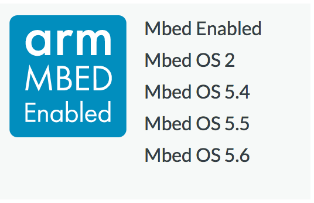

# Arm Mbed OS 2 vs. Arm Mbed OS 5

Arm Mbed OS 5 is a superset of Arm Mbed OS 2. This means that Mbed OS 5 *is* Mbed OS 2 but with more features, such as an RTOS.

## Overview

- Mbed OS 5 is a *superset* of Mbed OS 2.
- Mbed OS 5 is a combination of both Mbed OS 2 and Mbed-RTOS.
- Mbed OS 2 and Mbed OS 5 both use the same `mbed.h` file.
- Drivers are thread-safe in Mbed OS 5. Drivers are not thread-safe in Mbed OS 2.

To migrate from Mbed OS 2 to Mbed OS 5, [please follow our migration tutorial](../tutorials/migrating-to-mbed-os-5.html).

## FAQs

**Do Mbed OS 2 and Mbed OS 5 use the same header file?**

   Yes. Inside the `mbed.h` file in your Mbed OS project, you can see `if` statements that look at `MBED_CONF` variables. The `mbed_lib.json` files located in their respective Mbed OS directory define these variables. For example, in `mbed.h` you can find the following lines:

   ```
   #if MBED_CONF_RTOS_PRESENT
   #include "rtos/rtos.h"
   #endif
   ```

   RTOS is only present in Mbed OS 5. Therefore, if you are using Mbed OS 5, when the compiler encounters this line, it finds the following "present" value in the `/mbed-os/rtos/` directory:

   ```
   {
       "name": "rtos",
       "config": {
           "present": 1
       }
   }
   ```

   So, the `if` statement in the `mbed.h` file evaluates to `True`, and the RTOS header file is included. (In other words, it is present.) If you were running an Mbed OS 2 program, this `if` statement in `mbed.h` would evaluate to `False`. Thus, the RTOS is not present in your Mbed OS 2 program.

   If you want to learn more about how these configuration files work, please see [our configuration documentation](../reference/configuration.html).

**How can I tell which platforms support Mbed OS 2 or Mbed OS 5?**

   Visit the platform page for the board on [os.mbed.com/platforms](https://os.mbed.com/platforms/). For example, if you want to use the Mbed LPC1768 board for your project, visit its [platform page](https://os.mbed.com/platforms/mbed-LPC1768/). Then, scroll down the page. On the right-hand sidebar under the green "Follow" button is a list of Mbed OS versions that the board supports (signifying that the board is Mbed Enabled):

   <span class="images"></span>

**Do Mbed OS 2 and Mbed OS 5 use the same documentation?**

   No. Please see the corresponding documentation pages for Mbed OS 2 and Mbed OS 5:

   - [Mbed OS 5 documentation](https://os.mbed.com/docs).
   - [Mbed OS 5 GitHub repository](https://github.com/armmbed/mbed-os).
   - [Mbed OS 2 handbook](https://os.mbed.com/handbook/Homepage).
   - [Mbed OS 2 library](https://os.mbed.com/users/mbed_official/code/mbed/).

   If you see documentation for Mbed OS 2 and you want to see if there is an updated version of this page for Mbed OS 5, from the Handbook page, click on the link in the top yellow box. For example, you can see the yellow box at the top of the [LocalFileSystem page](https://os.mbed.com/handbook/LocalFileSystem) for Mbed OS 2.

   <span class="images"></span>

   Click on `the file system API` link to navigate to the updated documentation regarding this API for Mbed OS 5.

**How do I know if my project uses Mbed OS 2 or Mbed OS 5?**

   The presence of an `mbed.bld` or `mbed-rtos.lib` file signifies that the project uses a version of Mbed OS earlier than version 5. The presence of an `mbed-os.lib` file signifies that the project uses Mbed OS 5.

   Here is an example of an Mbed OS 2 project as viewed on [os.mbed.com](https://os.mbed.com):

   <span class="images"></span>
